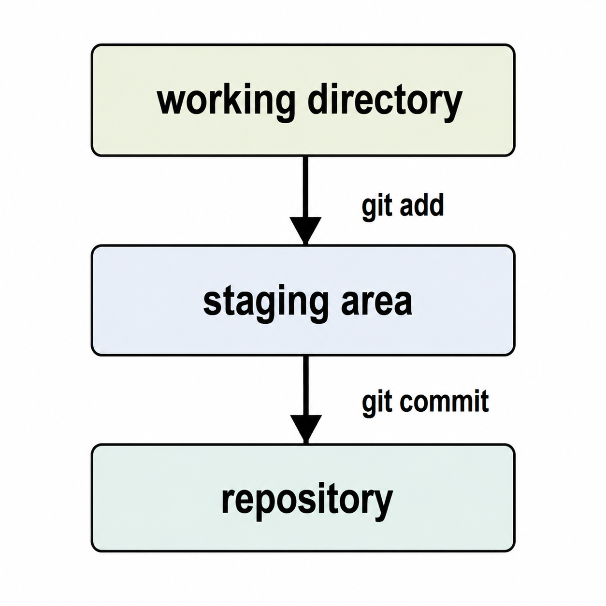

# Git Workshop

Git tracks your work across three areas, and you move changes between them with two key commands:

- **working directory**: the files you are currently editing on disk.
- **staging area**: the "waiting room" where you place the changes you want to include in the next commit, using `git add`.
- **repository**: the permanent history of commits, where changes land once you run `git commit`.

As the image below shows, `git add` moves changes from the working directory into the staging area, and `git commit` records the staged changes into the repository:

<p align="center">
  
</p>

## Create Your Own Repository

But how do you create your own directory and repository in the first place?

Before working on an existing project, let's warm up by building a repository from scratch.
This way you get to see how a repository is "born", and then connect it to the remote repository we will use throughout this workshop.

> [!IMPORTANT]
> We recommend you write all commands below by hand, i.e. without using copy & paste.
> This will get you better accustomed to Git and Git commands.

1. Create a new directory for your project and enter it:

   ```console
   mkdir workshop-git
   cd workshop-git/
   ```

   This is just a plain directory on disk.
   It is **not** a Git repository yet.

1. Initialize the repository:

   ```console
   git init
   ```

   `git init` turns the current directory into a Git repository.
   It creates a hidden `.git/` directory that holds all the data and metadata Git needs to track your work.

1. Look at what `git init` created:

   ```console
   ls -a
   ```

   You now see the `.git/` directory: your plain directory is now a Git repository.

So far the repository is empty and only lives on your machine.
This is a practical workshop consisting of common Git-related actions.
It is based on the [`unikraft/catalog-core` repository](https://github.com/unikraft/catalog-core), giving us a concrete Git repository to screw up ... hmmmm ... to do wonderful amazing great things to.
Let's connect our fresh repository to it and bring in its contents.

1. Add the workshop repository as a remote named `origin`:

   ```console
   git remote add origin https://github.com/rosedu/workshop-git
   ```

   A **remote** is a reference to another repository, typically hosted online.
   Naming it `origin` is just the widely used convention for the main remote.

1. Download all the branches and history from the remote:

   ```console
   git fetch origin
   ```

   `git fetch` downloads everything from the remote (all branches and commits) and stores it locally as remote-tracking branches (`origin/main`, `origin/base`, `origin/scripts`, ...), **without** touching your working directory yet.
   We need these branches available for the later parts of the workshop.

1. Pull the workshop contents into your working directory:

   ```console
   git pull origin main
   ```

   `git pull` fetches the `main` branch from the remote and merges it into your current branch.
   Your previously empty repository now contains all the workshop files.

> [!TIP]
> The four steps above - `git init`, `git remote add`, `git fetch`, and `git pull` - are exactly what `git clone` does for you in a single command.
> Instead of building the repository by hand, you could have obtained the same result with:
>
> ```console
> git clone https://github.com/rosedu/workshop-git
> cd workshop-git/
> ```
>
> We did it step by step here so you can see how a repository is created and connected to a remote.

And let's get going! 🚀

> [!NOTE]
> If, at any point in time, you miss a command, or something bad simply happened, reset the environment by running:
>
> ```console
> ./reset-all.sh
> ```

## Inspect Repository

1. See the current branch and status:

   ```console
   git status
   ```

   Git commands happen in a repository.
   A **repository** is the collection of data and metadata that you use to manage content, typically code.

   All Git commands start with `git`.
   They are then followed by arguments.
   The `status` argument is the argument of choice to get the state of the repository and the current branch.
   `git status` is probably the most used Git command, due to it providing information on the repository state.

1. See local branches:

   ```console
   git branch
   ```

   A **branch** is a specific setup and evolution of the repository.
   A repository consists of multiple branches, among which you can switch.

1. See local and remote branches:

   ```console
   git branch -a
   ```

   A local repository is typically a **clone** of a remote repository.
   It can also be connected to multiple remote repositories.
   All repositories have branches, that may or may not be in sync with each other.

1. Make remote branches available locally:

   ```console
   git branch base origin/base
   git branch scripts origin/scripts
   ```

   A local branch can be created to "follow" a remote branch.
   Note that changes to local branches are not implicitly made available to remote branches or vice versa.
   You must use specific actions to sync them: `push` and `pull`.
   We will not cover branch syncing in this workshop.

1. See local branches again.
   Note the difference (green color, `*` - *star* character) between the current branch and other local branches:

   ```console
   git branch
   ```

1. Show verbose information about branches:

   ```console
   git branch -v
   git branch -vv
   git branch -vv -a
   ```

1. Check out to a local branch:

   ```console
   git checkout base
   git branch
   git status
   ls
   git checkout scripts
   git branch
   git status
   ls
   git checkout main
   git branch
   git status
   ls
   ```

   Switching among branches is also called checking out.


### Do It Yourself

1. Do more listing.
   Try out the other commands [here](https://graphite.dev/guides/git-list-all-files).

1. Check out (switch to) the `test` branch from the remote `origin/test` branch.
   List contents, get back to the `main` branch.

## Inspect Commit History

1. Make sure you are on the `main` branch:

   ```console
   git checkout main
   git status
   ```

1. List commit history:

   ```console
   git log
   git log base
   git log --oneline base
   git log --pretty=fuller
   ```

   A **commit** is an individual collection of changes to the repository.
   It represents a given state of the repo.
   You can compare a commit to a save file or checkpoint in a video game.

   A commit consists of actual changes to the files in the repository and metadata: timestamp, authorship, commit description.
   Commit description is very important to have a good understanding of the repository and rationale for changes.
   Be sure to follow [best practices in creating commits and commit descriptions](https://cbea.ms/git-commit/).

   A branch is a series of commits, called a **history of commits**.
   Each branch has its own commit history.

1. Show top commit contents:

   ```console
   git show
   git show HEAD
   ```

   The `HEAD` keyword is an alias for the latest (most recent) commit in the current branch.

1. Show commit contents by commit ID:

   ```console
   git show 1a02ae3
   ```

   Each commit is identified by a commit ID, typically a [SHA-1](https://en.wikipedia.org/wiki/SHA-1) hash of the commit contents.

1. Only show actual contents, no metadata:

   ```console
   git show --pretty="" 1a02ae3
   ```

1. Only show modified files:

   ```console
   git show --pretty="" --name-only 1a02ae3
   ```

1. Show commits that modified a file:

   ```console
   git checkout base
   git blame README.md
   git checkout main
   ```

   `git blame` shows the latest modification of each line in the file: latest commit ID, together with timestamp and author.

1. Show commits that modified a path:

   ```console
   git log scripts -- README.md
   git log scripts -- c-fs
   ```

1. Show difference between two commits / references:

   ```console
   git diff base scripts
   ```

   `git diff` shows lines that need to be added (`+`) or removed (`-`) in order to get from the first reference to the second one.

### Do It Yourself

1. How are the three branches (`base`, `scripts`, `test`) constructed?
   Which is constructed on top of the other?

1. Do more history inspection.

## Configure Git

1. Show local Git configuration:

   ```
   git config -l
   git config user.name
   git config user.email
   ```

   Git uses configuration variables, such as `user.name` or `user.email` or `color.ui` to customize command effects, i.e. author being used, coloring, aliases, files to be ignored.

1. If not already configured, configure your name and e-mail:

   ```console
   git config --global user.name "<your-full-name-here>"
   git config --global user.email "<your-email-here>"
   ```

   Use your full name as you would typically do: `Firstname Lastname`.

1. Configure colored output:

   ```console
   git config --global color.ui "auto"
   ```

1. Configure aliases:

   ```console
   git config --global alias.lg 'log --pretty=fuller'
   git lg
   ```

   An **alias** is typically a short name for a common command, to make typing more efficient or to make it easier to remember.

1. Check the configuration:

   ```console
   cat .git/config
   cat ~/.gitconfig
   ```

   The `.git/config` is the local repository Git configuration file.
   The `~/.gitconfig` is the global Git configuration file.
   The `git config` command reads from and makes updates to these files.

## Clean Up / Reset Your Git Environment

We make mistakes:
- We create commits we shouldn't have (yet) created.
- We leave changes out of commits.
- We amend the wrong commit.
- We do merges / rebases / cherry-picks that fail.
- We add a change in the staging area that we shouldn't have (yet) added.
- We delete a file by mistake.

These things happen.
We solve them.
We just need to know how to do that.

1. First prepare a messed up environment, by running:

   ```console
   ./mess-it-up.sh
   ```

1. Now look at the mess:

   ```console
   git status
   ```

1. See the commit history:

   ```console
   git log
   ```

   See the `bla bla` commit (latest).
   And see the wrong message (`Bue` instead of `Bye`) for the other other commit.

1. **Note**: If, at any point in time, you miss a command, or something bad simply happened, reset the environment by running:

   ```console
   ./reset-all.sh
   ```

   Then go back to step 1 and prepare the messed up environment again.

1. Let's first get rid of all the temporary files we do not require (they were added by mistake):

   ```console
   git clean -d -f
   git status
   ```

   `git clean` removes files that are not used (not tracked) in the repository.
   Files are **tracked** if there are commits with contents of those files.
   Files are **not tracked / untracked** if there are no commits related to those files.

   Untracked files appear, in the `git status` output, typically colored red, marked with `Untracked files:`.

1. Restore the deleted `Makefile`:

   ```console
   git status
   git restore c-hello/Makefile
   git status
   ```

   When you delete or modify a tracked file, its changes appear in the **"tracking" area**, typically colored red, marked with `Changes not staged for commit:`.
   You can restore changes to its original contents.

1. Restore the staged deleted `hello.c`:

   ```console
   git status
   git restore --staged c-hello/hello.c
   git status
   git restore c-hello/hello.c
   git status
   ```

   When you delete or modify a tracked file, and then you add changes (via `git add` or `git rm`), its changes appear in the **"staging" area**, typically colored green, marked with `Changes to be committed:`.
   You can get a file from the "staging" area to the "tracking" area via `git restore --staged`.
   You can then restore changes to its original contents, and remove the file from the "tracking" area, via `git restore`.

1. Restore the staged new file `c-bye/build.fc.x86_64` to create a proper commit:

   ```console
   git status
   git restore --staged c-bye/build.fc.x86_64
   git status
   ```

1. See the commit history again:

   ```console
   git log
   ```

1. Remove the `bla bla` commit:

   ```console
   git reset HEAD^
   git status
   git log
   rm blabla.txt
   ```

   Adding a caret sign (`^`) after a commit reference points to the previous commit.
   `git reset` discards all commits after the argument reference.

1. Update the commit message from `Bue` to `Bye`:

   ```console
   git log
   git commit --amend    # do edit as required
   git log
   git show
   ```

   The `git commit --amend` command presents a commit description edit screen.
   After saving the changes and exiting the edit screen, the commit description (and its ID / SHA hash) are updated.

1. Create a new commit with the `c-bye/build.fc.x86_64` file:

   ```console
   git add c-bye/build.fc.x86_64
   git commit -s -m 'c-bye: Add Firecracker build script for x86_64'
   git log
   git show
   git status
   ```

### Do It Yourself

1. Repeat the above steps at least 2 more times.

   Aim to have one time without checking the instructions.
   That is, run the `./mess-it-up.sh` script and then repair the mess by yourself.

   If, at any point, you get lost, run the reset script:

   ```console
   ./reset-all.sh
   ```

1. Do your own messing up of the environment.
   Go to a given branch, remove files, create new files, create commits, add files to staging area etc.
   Then repair the environment.

   If, at any point, you get lost, run the reset script:

   ```console
   ./reset-all.sh
   ```

## Stash Changes

Sometimes you are in the middle of editing files, but you are **not** ready to commit yet.
Maybe you need to quickly switch to another branch, or pull in new changes, but Git complains that you have uncommitted work.

`git stash` solves this: it **pauses** your work by setting your uncommitted changes aside, leaving you a clean working directory.
Later, you **resume** your work by bringing those changes back, exactly where you left off.

You can think of the stash as a separate "drawer" where Git temporarily stores your unfinished changes.
It is neither the working directory, nor the staging area, nor the repository: it is a place on the side.

Make sure you are on the `main` branch and everything is clean:

```console
git checkout main
git status
```

Or, reset the repository:

```console
./reset-all.sh
```

1. Make a change to a tracked file, so you have some work in progress:

   ```console
   echo "# work in progress" >> README.md
   git status
   ```

   `git status` shows your change under `Changes not staged for commit:`.
   This is the work we want to pause.

1. Pause your work by stashing it:

   ```console
   git stash
   git status
   ```

   `git stash` takes your uncommitted changes (both staged and unstaged), saves them aside, and restores your working directory to a clean state.
   Notice how `git status` now reports `nothing to commit, working tree clean`: your change seems to be gone, but it is only set aside.

1. List your stashed changes:

   ```console
   git stash list
   ```

   Each stash entry is shown as `stash@{0}`, `stash@{1}`, ... with `stash@{0}` being the most recent one.
   Your paused work is safely stored there.

   You can also peek at what a stash contains, without restoring it:

   ```console
   git stash show -p
   ```

1. Resume your work by bringing the changes back:

   ```console
   git stash pop
   git status
   ```

   `git stash pop` re-applies the most recent stash to your working directory and then **removes** it from the stash list.
   Your change to `README.md` is back, exactly as you left it: you are right where you stopped.

   Check that the stash list is now empty:

   ```console
   git stash list
   ```

> [!TIP]
> If you want to bring the changes back but **keep** the stash entry (for example, to apply it on several branches), use `git stash apply` instead of `git stash pop`.
> You can later remove a stash you no longer need with `git stash drop`.

### Do It Yourself

1. Reset the configuration:

   ```console
   ./reset-all.sh
   ```

1. Reproduce the classic stash scenario: switching branches with unfinished work.

   - On the `main` branch, make a change to a tracked file.
   - Stash it with `git stash`.
   - Check out another branch (for example `git checkout base`), look around, then check out `main` again.
   - Bring your work back with `git stash pop`.

   If, at any point, you get lost, run the reset script:

   ```console
   ./reset-all.sh
   ```

## Create Commits

We will get some new content that we will add as commits to the repository.
Make sure you are on the `main` branch and everything is clean:

```console
git checkout main
```

Or, reset the repository:

```console
./reset-all.sh
```

1. Create contents from archive:

   ```console
   unzip support/c-bye.zip
   git status
   ```

   We now have a `c-bye/` directory:

   ```console
   ls c-bye/
   ```

   There are a lot of files.
   We want to add them as 3 separate commits in 3 separate branches.

   1. The `bye.c`, `Makefile`, `Makefile.uk`, `fc...`, `xen...`, `README.md` files will go to the `base` branch.
   1. The `defconfig...`, `build...`, `run...`, `README.scripts.md` files will go to the `scripts` branch.
   1. The `test...` files will go to the `test` branch.

1. Go to the `c-bye/` directory:

   ```console
   cd c-bye/
   ls
   ```

### `base` branch

Let's create commit to `base` branch:

1. Check out the `base` branch:

   ```console
   git checkout base
   ```

1. Add contents to staged area:

   ```console
   git add bye.c Makefile Makefile.uk README.md xen.* fc.* .gitignore
   git status
   ```

1. Create the commit:

   ```console
   git commit -s -m 'Introduce C Bye on Unikraft'
   ```

1. List the commit:

   ```console
   git log
   git show
   ```

1. Look at the commit for the initial C Hello program:

   ```console
   git show 7fd6e9290dddc2ae799ae5df684668a7d16e87f3
   ```

   The commit message is:

   ```text
   Introduce C Hello on Unikraft

   Add `c-hello/` directory:

   - `hello.c`: the source code file
   - `Makefile.uk`: defining the source code files used
   - `Makefile`: for building the application
   - `fc.x86_64.json` / `fc.arm64.json`: Firecracker configuration
   - `xen.x86_64.cfg` / `xen.arm64.cfg`: Xen configuration
   - `README.md`: instructions
   - `.gitignore`: ignore generated files
   ```

   We want something similar for our C bye commit.

1. Update the commit message by amending:

   ```console
   git commit --amend
   ```

   You get an editable screen.
   Edit the commit message to have contents similar to the one for C Hello.
   Use copy & paste.

   You can use `git commit --amend` to constantly update the commit.

   See the final result with:

   ```console
   git log
   git show
   ```

### `scripts` branch

Let's create commit to `scripts` branch:

1. Check out the `scripts` branch:

   ```console
   git checkout scripts
   ```

1. Add contents to staged area:

   ```console
   git add defconfig.* build.* run.* README.scripts.md
   git status
   ```

1. Create the commit:

   ```console
   git commit -s -m 'c-bye: Add scripts'
   ```

1. List the commit:

   ```console
   git log
   git show
   ```

1. Look at the commit for the initial C Hello program:

   ```console
   git show 04cf0f57f2853d73a5c25082d4652fef63da8f57
   ```

   The commit message is:

   ```text
   c-hello: Add scripts

   Use scripts as quick actions for building and running C Hello on Unikraft.

    - `defconfig.<plat>.<arch>`: default configs, used by build scripts
    - `build.<plat>.<arch>`: scripts for building Unikraft images
    - `run.<plat>.<arch>`: scripts for running Unikraft images
    - `README.script.md`: companion README with instructions
   ```

   We want something similar for our C bye commit.

1. Update the commit message by amending:

   ```console
   git commit --amend
   ```

   You get an editable screen.
   Edit the commit message to have contents similar to the one for C Hello.
   Use copy & paste.

   You can use `git commit --amend` to constantly update the commit.

   See the final result with:

   ```console
   git log
   git show
   ```

### `test` branch

Let's create commit to `test` branch:

1. Check out the `test` branch:

   ```console
   git checkout test
   ```

1. Add contents to staged area:

   ```console
   git add test*
   git status
   ```

1. Create the commit:

   ```console
   git commit -s -m 'c-bye: Add test scripts'
   ```

1. List the commit:

   ```console
   git log
   git show
   ```

### Do It Yourself

1. Reset the configuration:

   ```console
   ./reset-all.sh
   ```

1. Repeat the above steps at least 2 more times.

   Aim to have one time without checking the instructions.
   That is, create the 3 commits in the 3 branches for C bye.

   If, at any point, you get lost, run the reset script:

   ```console
   ./reset-all.sh
   ```

1. Do the same for the C++ Bye program.

   Make sure you are on the `main` branch:

   ```console
   git status
   git checkout main
   ```

   First unpack the contents:

   ```console
   unzip support/cpp-bye.zip
   git status
   ```

   We now have a `cpp-bye/` directory:

   ```console
   ls cpp-bye/
   ```

   There are a lot of files.
   We want to add them as 3 separate commits in 3 separate branches.

   1. The `bye.cpp`, `Makefile`, `Makefile.uk`, `Config.uk`, `fc...`, `xen...`, `README.md` files will go to the `base` branch.
   1. The `defconfig...`, `build...`, `run...`, `README.scripts.md` files will go to the `scripts` branch.
   1. The `test...` files will go to the `test` branch.

   Follow the steps for C Bye to create the commits for C++ Bye.

1. Do the same for the Python Bye program.

   Make sure you are on the `main` branch:

   ```console
   git status
   git checkout main
   ```

   First unpack the contents:

   ```console
   unzip support/python3-bye.zip
   git status
   ```

   We now have a `python3-bye/` directory:

   ```console
   ls python3-bye/
   ```

   There are a lot of files.
   We want to add them as 3 separate commits in 3 separate branches.

   1. The `bye.py`, `Makefile`, `Makefile.uk`, `Config.uk`, `fc...`, `xen...`, `README.md` files will go to the `base` branch.
   1. The `defconfig...`, `build...`, `run...`, `README.scripts.md` files will go to the `scripts` branch.
   1. The `test...` files will go to the `test` branch.

   Follow the steps for C bye to create the commits for Python3 Bye.
